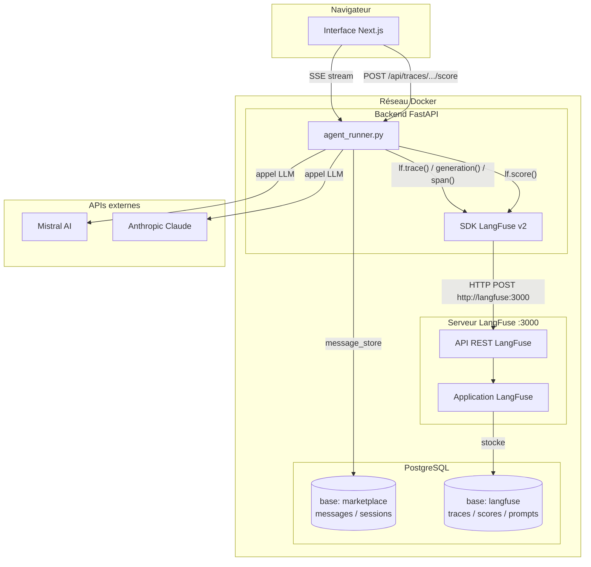
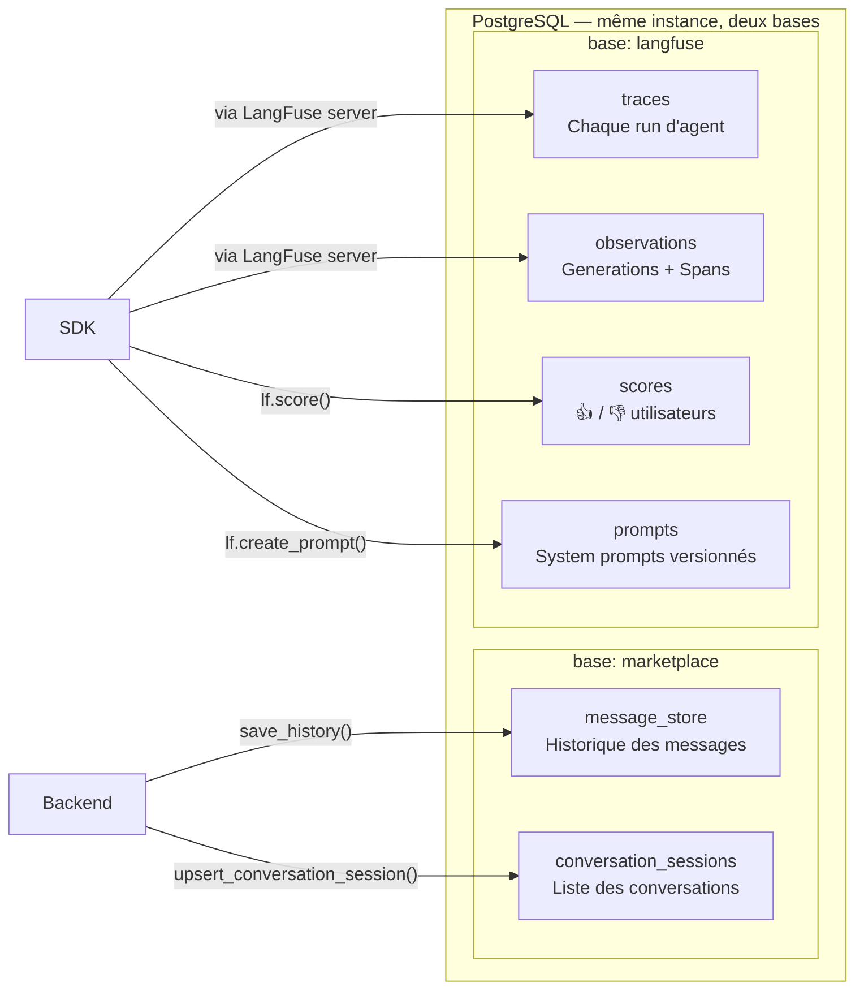
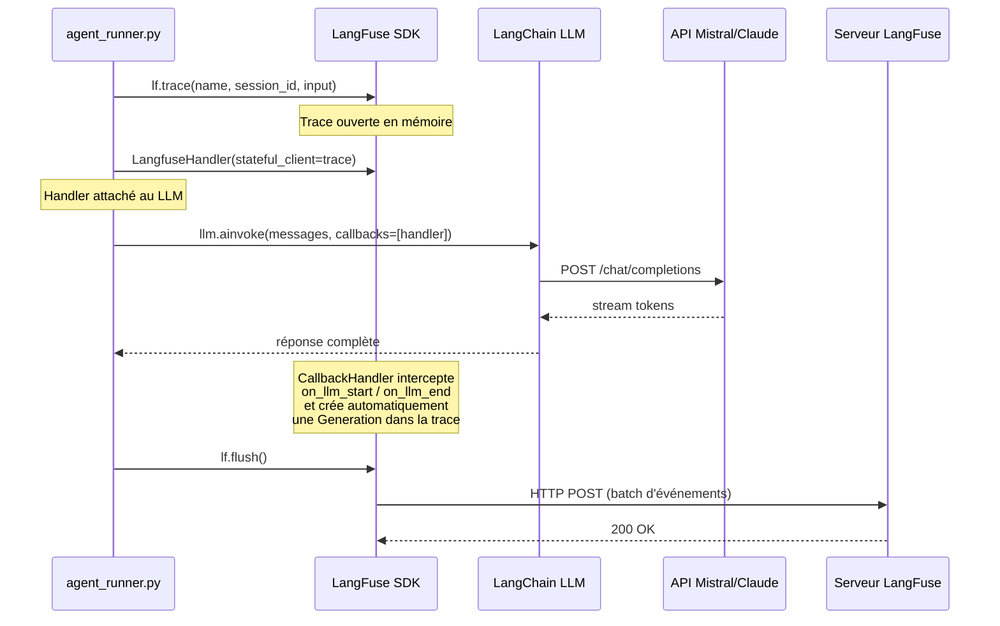
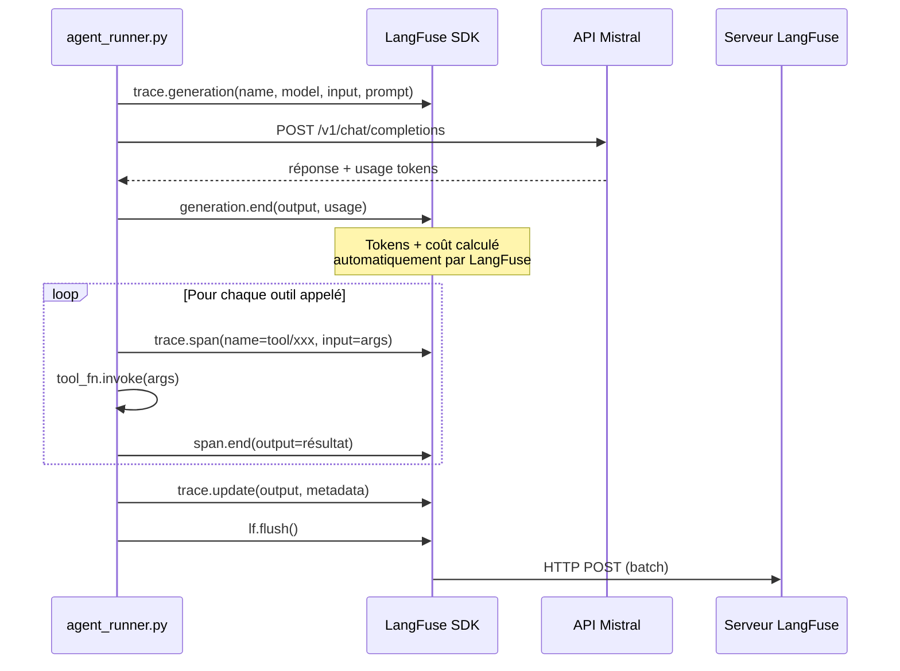
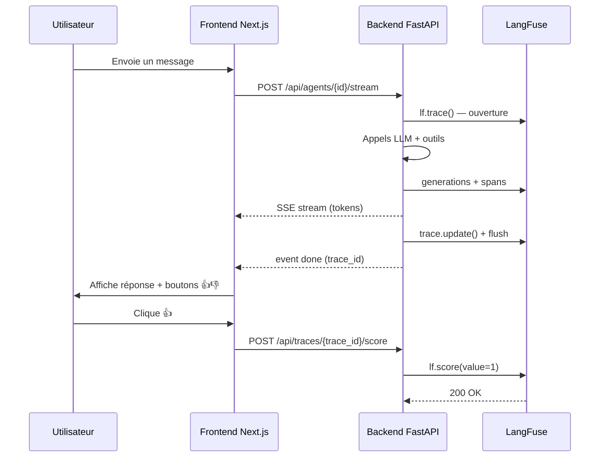

# LangFuse — Observabilité pour agents IA

> **Rôle dans ce projet** : LangFuse est le système de monitoring de toutes les exécutions d'agents. Il enregistre chaque conversation, chaque appel LLM, chaque outil utilisé, avec les tokens consommés, les coûts, les latences — et permet de collecter les retours utilisateurs.


Model definition 

name : mistral-small-latest
input price per token : 0.00000015
output price per token: 0,00000060
pattern: (?i)^(mistral-small-latest)$
---

## Pourquoi LangFuse ?

Les agents IA sont des boîtes noires par nature. Sans observabilité, impossible de répondre à ces questions :

| Question | Sans LangFuse | Avec LangFuse |
|---|---|---|
| Pourquoi cette réponse est mauvaise ? | Mystère | Trace complète : prompt → outils → réponse |
| Quel agent coûte le plus cher ? | Calcul manuel | Dashboard en temps réel |
| Les réponses s'améliorent-elles ? | Subjectif | Scores utilisateurs agrégés |
| Combien de tokens par session ? | Approximatif | Exact, par session/agent/modèle |
| Où se passe la latence ? | Inconnu | Chaque span est chronométré |

---

## Architecture générale



---

## Ce qui est stocké et où



**Deux bases, un seul PostgreSQL.** La base `langfuse` est créée automatiquement au premier démarrage via `db/init.sql`. LangFuse gère ses propres migrations Prisma dedans.

---

## Comment LangFuse s'intègre avec LangChain

LangChain propose un système de **callbacks** : des hooks appelés automatiquement à chaque étape (début LLM, token reçu, fin LLM, outil appelé...). LangFuse fournit un `CallbackHandler` qui écoute ces événements et crée les traces correspondantes.



### Chemin Mistral (direct HTTP — sans LangChain)

Pour Mistral, le code bypass LangChain et appelle l'API directement (bug de sérialisation des tool_call_id). Dans ce cas, le tracking est **manuel** :



---

## Architecture de la trace

Chaque message utilisateur génère une trace avec cette hiérarchie :

```
Trace: agent/seo-analysis  [session: abc-123]
│
├── Generation: mistral-llm-0          ← 1er appel LLM
│   ├── input: [system, history, user]
│   ├── output: "Je vais analyser..."
│   └── usage: 1 200 input / 85 output tokens
│
├── Span: tool/web_search              ← Outil déclenché
│   ├── input: { query: "SEO best practices 2025" }
│   └── output: "Résultat de la recherche..."
│
├── Generation: mistral-llm-1          ← 2ème appel LLM après outil
│   ├── input: [... + résultat outil]
│   ├── output: "Voici l'analyse complète..."
│   └── usage: 2 100 input / 420 output tokens
│
└── Score: user-feedback = 1           ← 👍 utilisateur
```

---

## Ce qui est tracé

### 1. Traces (par message utilisateur)

Chaque appel à `stream_agent()` crée une trace avec :

- **`name`** : `agent/{agent_id}` (ex: `agent/seo-analysis`)
- **`session_id`** : identifiant de la conversation — regroupe tous les messages d'une session
- **`input`** : le message de l'utilisateur
- **`output`** : la réponse finale de l'agent
- **`tags`** : `[agent_id, provider]` — pour filtrer dans le dashboard
- **`metadata`** : modèle utilisé, nombre d'outils, longueur de l'historique, tokens

### 2. Generations (appels LLM)

**Pour Mistral (direct HTTP)** : chaque itération de la boucle d'outils est une génération distincte, avec le modèle, l'historique complet, les tokens input/output. LangFuse calcule le coût automatiquement grâce aux modèles enregistrés au démarrage.

**Pour Claude (LangChain)** : le `CallbackHandler` LangFuse capture automatiquement chaque `ainvoke()`.

**Pour le streaming simple** (sans outils) : le `CallbackHandler` capture le flux complet.

### 3. Spans (exécutions d'outils)

Chaque outil déclenché par l'agent crée un span :
- **`name`** : `tool/{nom_outil}` (ex: `tool/web_search`, `tool/gmail_read`)
- **`input`** : les arguments passés à l'outil
- **`output`** : le résultat (tronqué à 4 000 caractères)
- **Durée** : automatiquement calculée (start → end)

### 4. Sessions (regroupement de conversations)

Le `session_id` relie toutes les traces d'une même conversation. Dans le dashboard LangFuse, la vue "Sessions" permet de voir l'intégralité d'un échange multi-tours avec l'évolution des coûts.

### 5. Scores (feedback utilisateurs)

Les boutons 👍 / 👎 dans l'interface envoient un score LangFuse :
- `value: 1` → réponse utile
- `value: -1` → réponse mauvaise
- `name: "user-feedback"`

### 6. Prompts (gestion des system prompts)

Au premier run de chaque agent, le `system_prompt.txt` est automatiquement pushé dans LangFuse. Ensuite il est éditable depuis le dashboard sans redéployer, avec historique de versions.

---

## Configuration

### Variables d'environnement

| Variable | Local | Prod |
|---|---|---|
| `LANGFUSE_PUBLIC_KEY` | clé du projet LangFuse local | injectée par Ansible (vault) |
| `LANGFUSE_SECRET_KEY` | clé du projet LangFuse local | injectée par Ansible (vault) |
| `LANGFUSE_HOST` | `http://langfuse:3000` (défaut docker-compose) | idem — ne pas surcharger |
| `LANGFUSE_NEXTAUTH_URL` | `http://162.19.241.44:42003` (défaut) | `https://langfuse.agents.hanibal.fr` (Ansible) |

**LangFuse est optionnel** : si les clés sont vides, le tracing est désactivé silencieusement.

### Accès au dashboard

| Environnement | URL |
|---|---|
| Local | `http://162.19.241.44:42003` |
| Production | `https://langfuse.agents.hanibal.fr` |

Email : `admin@oc-agents.local` — Mot de passe : `adminadmin`

---

## Flux complet avec score utilisateur



---

## Utilisation au quotidien

### Déboguer une mauvaise réponse

1. Ouvrir LangFuse → **Traces**
2. Filtrer par tag (`agent_id`) ou par `session_id`
3. Cliquer sur la trace → voir exactement : quel prompt, quel historique, quels outils, quelle réponse

### Surveiller les coûts

**Dashboard → Analytics → Cost** : coût total par jour, par agent, par modèle.
- Filtrer `tag = claude` → coût total agents Claude
- Comparer avec `tag = mistral`

### Améliorer un agent

1. Filtrer les traces avec `score < 0` (feedback négatif)
2. Lire les conversations qui ont mal tourné
3. Corriger le prompt directement dans **Prompts** → `agent/{id}` sans redéployer

### Comparer les modèles (A/B)

LangFuse permet de voir les performances de deux modèles sur les mêmes types de requêtes — utile pour décider si passer un agent de Mistral à Claude vaut le coût supplémentaire.

---

## SDK et fichiers clés

**Package** : `langfuse>=2.0.0,<3.0.0` — pinné en v2 car la v4 (OpenTelemetry) a une API incompatible avec le code actuel.

| Chemin LLM | Méthode de tracking |
|---|---|
| Mistral (direct HTTP) | Générations + spans manuels via SDK |
| Claude (LangChain + outils) | `CallbackHandler(stateful_client=trace)` pour LLM, spans manuels pour outils |
| Streaming simple (sans outils) | `CallbackHandler(stateful_client=trace)` capture tout automatiquement |

**Fichiers clés** :
- `backend/app/services/agent_runner.py` — intégration complète tracing + prompts
- `backend/app/routers/agents.py` — endpoint `POST /api/traces/{trace_id}/score`
- `backend/main.py` — enregistrement des modèles au démarrage (`register_models_in_langfuse`)
- `frontend/app/api/traces/[trace_id]/score/route.ts` — proxy Next.js
- `frontend/components/AgentFullPage.tsx` — composant `FeedbackButtons`
- `db/init.sql` — création de la base `langfuse`
