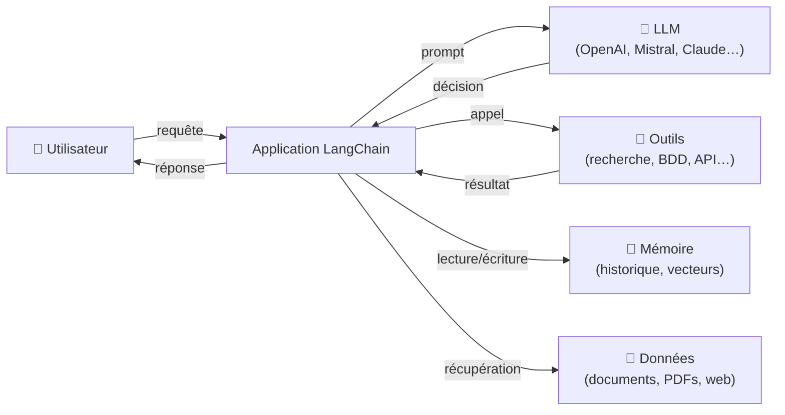
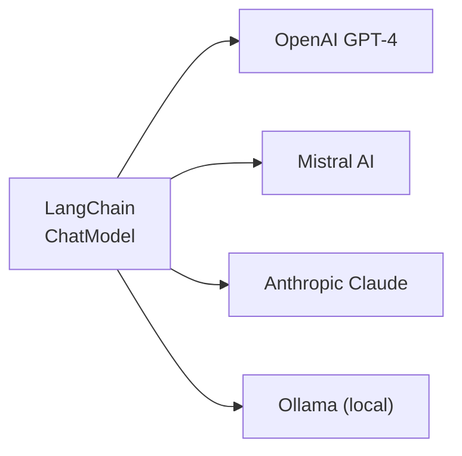
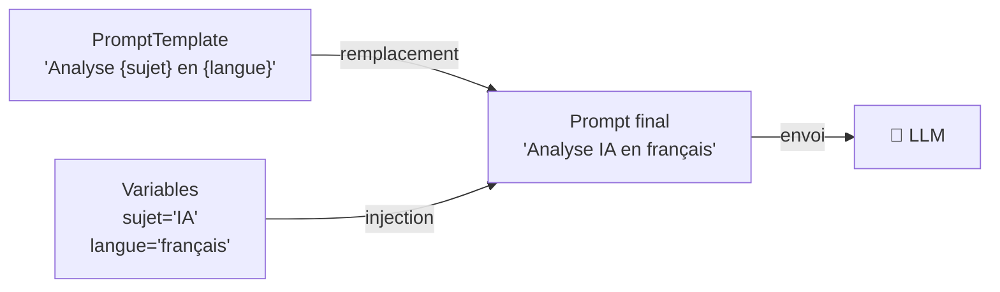
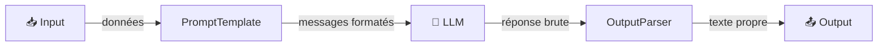
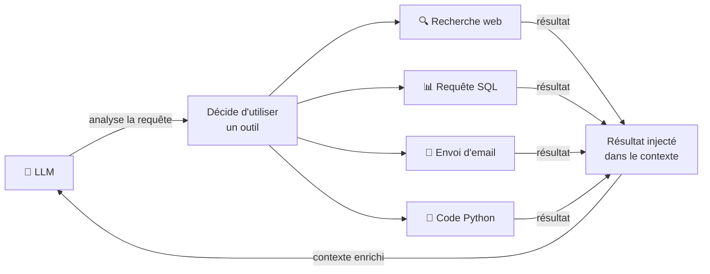
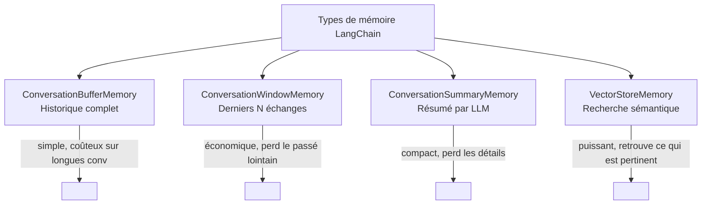
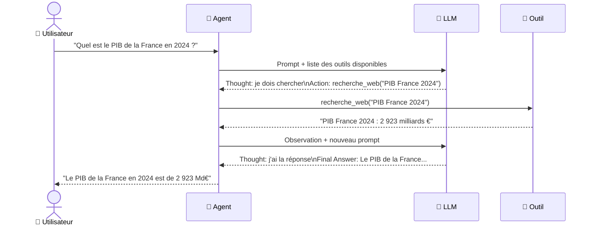
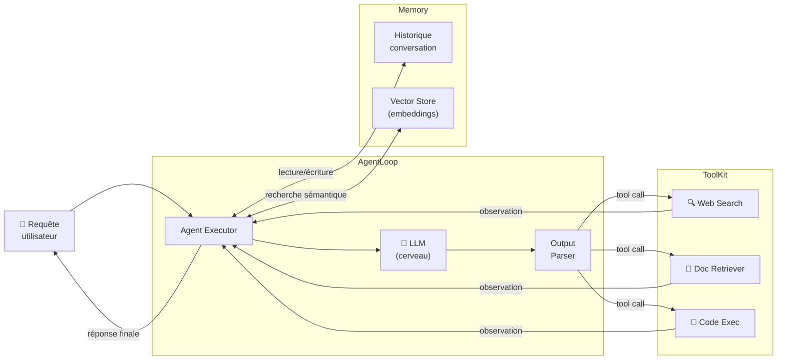
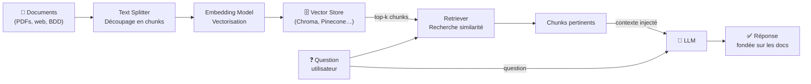
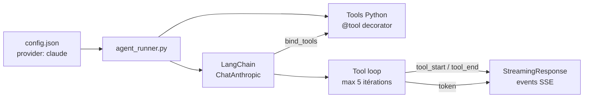

# LangChain

LangChain est un framework open-source qui permet de construire des applications alimentées par des modèles de langage (LLM). Il fournit des abstractions pour chaîner des appels LLM, connecter des outils externes, gérer la mémoire et orchestrer des agents autonomes.

---

## Vue d'ensemble



LangChain joue le rôle de **chef d'orchestre** : il prépare les prompts, décide quels outils utiliser, gère la mémoire de contexte et assemble la réponse finale.

---

## Les composants fondamentaux

### 1. Les modèles (LLMs & Chat Models)

LangChain abstrait l'accès aux différents LLMs derrière une interface unifiée. Peu importe le fournisseur, l'appel reste identique dans le code.



```python
from langchain_anthropic import ChatAnthropic
from langchain_mistralai import ChatMistralAI

# Même interface, fournisseurs différents
llm_claude  = ChatAnthropic(model="claude-sonnet-4-6")
llm_mistral = ChatMistralAI(model="mistral-small-latest")

reponse = llm_claude.invoke("Explique LangChain en une phrase.")
```

---

### 2. Les Prompts

Les **PromptTemplates** permettent de construire des prompts dynamiques en injectant des variables. Ils séparent la logique métier du texte brut.



```python
from langchain_core.prompts import ChatPromptTemplate

prompt = ChatPromptTemplate.from_messages([
    ("system", "Tu es un expert en {domaine}."),
    ("human",  "{question}"),
])

# Génère le prompt final avec les variables
messages = prompt.format_messages(
    domaine="cybersécurité",
    question="Qu'est-ce qu'une injection SQL ?"
)
```

---

### 3. Les Chaînes (LCEL)

Le **LangChain Expression Language (LCEL)** permet d'assembler des composants avec l'opérateur `|` pour former des pipelines déclaratifs.



```python
from langchain_core.output_parsers import StrOutputParser

# Chaîne déclarative avec l'opérateur pipe
chain = prompt | llm | StrOutputParser()

# Exécution
result = chain.invoke({
    "domaine": "cybersécurité",
    "question": "Qu'est-ce qu'une injection SQL ?"
})
```

Ce modèle de composition est puissant : chaque étape est indépendante, testable et remplaçable.

---

### 4. Les Outils (Tools)

Les outils permettent au LLM d'**agir sur le monde** : faire des recherches, lire une base de données, appeler une API, exécuter du code.



```python
from langchain.tools import tool

@tool
def recherche_meteo(ville: str) -> str:
    """Retourne la météo actuelle d'une ville."""
    # Appel API météo...
    return f"Il fait 22°C et ensoleillé à {ville}."
```

Le décorateur `@tool` expose automatiquement la fonction au LLM avec son nom, sa description et son schéma d'entrée.

---

### 5. La Mémoire

Par défaut un LLM est **sans état** — il ne se souvient pas des échanges précédents. LangChain propose plusieurs types de mémoire :



```python
from langchain.memory import ConversationBufferWindowMemory

memory = ConversationBufferWindowMemory(k=5)  # garde les 5 derniers échanges

memory.save_context(
    {"input": "Mon nom est Yohann"},
    {"output": "Bonjour Yohann !"}
)
```

---

### 6. Les Agents

Un **agent** est la pièce maîtresse de LangChain : il utilise un LLM comme moteur de raisonnement pour décider **à chaque étape** quelle action effectuer, jusqu'à obtenir la réponse finale.

#### Cycle de raisonnement ReAct



Ce cycle **Thought → Action → Observation** se répète jusqu'à ce que l'agent considère avoir suffisamment d'informations.

#### Types d'agents

| Type | Description | Usage |
|------|-------------|-------|
| `ReAct` | Raisonnement + Action en alternance | Usage général |
| `OpenAI Tools` | Utilise le function calling natif d'OpenAI | GPT-4, performances élevées |
| `Structured Chat` | Sorties structurées JSON | Intégrations complexes |
| `Self-Ask` | Se pose des sous-questions | Raisonnement multi-étapes |

---

## Architecture complète d'un agent LangChain



---

## RAG — Retrieval Augmented Generation

Le **RAG** est l'un des patterns les plus utilisés avec LangChain. Il permet d'enrichir le contexte du LLM avec des documents externes au lieu de tout stocker dans le prompt.



```python
from langchain_community.vectorstores import Chroma
from langchain_openai import OpenAIEmbeddings
from langchain.chains import RetrievalQA

# Indexation des documents
vectorstore = Chroma.from_documents(
    documents=chunks,
    embedding=OpenAIEmbeddings()
)

# Chaîne RAG
qa_chain = RetrievalQA.from_chain_type(
    llm=llm,
    retriever=vectorstore.as_retriever(search_kwargs={"k": 4}),
)

reponse = qa_chain.invoke("Quelle est la politique de remboursement ?")
```

---

## LangChain dans ce projet

Dans `marketplace-oc-agents`, LangChain est utilisé uniquement pour les agents configurés avec le provider **Claude** (Anthropic). Le flow Python dans `backend/app/services/agent_runner.py` suit ce pattern :



Pour **Mistral**, le projet utilise une boucle d'appel direct à l'API REST sans passer par LangChain (voir `_mistral_tool_loop` dans `agent_runner.py`).

---

## Ressources

- [Documentation officielle LangChain](https://python.langchain.com/docs/)
- [LangChain Expression Language (LCEL)](https://python.langchain.com/docs/expression_language/)
- [LangSmith — observabilité](https://smith.langchain.com/)
- [LangGraph — agents multi-étapes complexes](https://langchain-ai.github.io/langgraph/)
