# Graph LangGraph — Agent de Prospection Hanibal

> **Principe directeur** : Hanibal applique à lui-même la méthode qu'il vend. L'Agent de Prospection est le premier **actif agentique gouverné** — un démonstrateur interne de la méthode avant d'être une offre client.

---

## 0. Intention stratégique

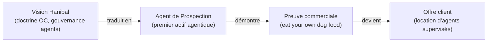

L'agent joue un **double rôle** :
- **Outil interne d'acquisition** — aide Hanibal à prospecter concrètement
- **Démonstrateur de méthode** — prouve que les agents supervisés fonctionnent sur un cas réel

---

## 1. Les 7 fonctions de l'agent

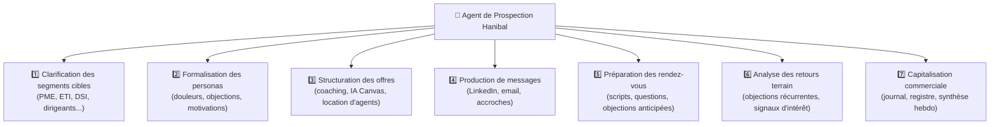

---

## 2. Ce que l'agent peut et ne peut pas faire

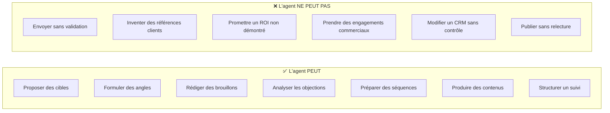

---

## 3. Grille de tri du travail réel

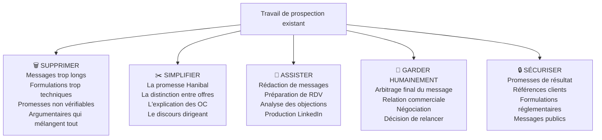

---

## 4. Graphe de connaissances

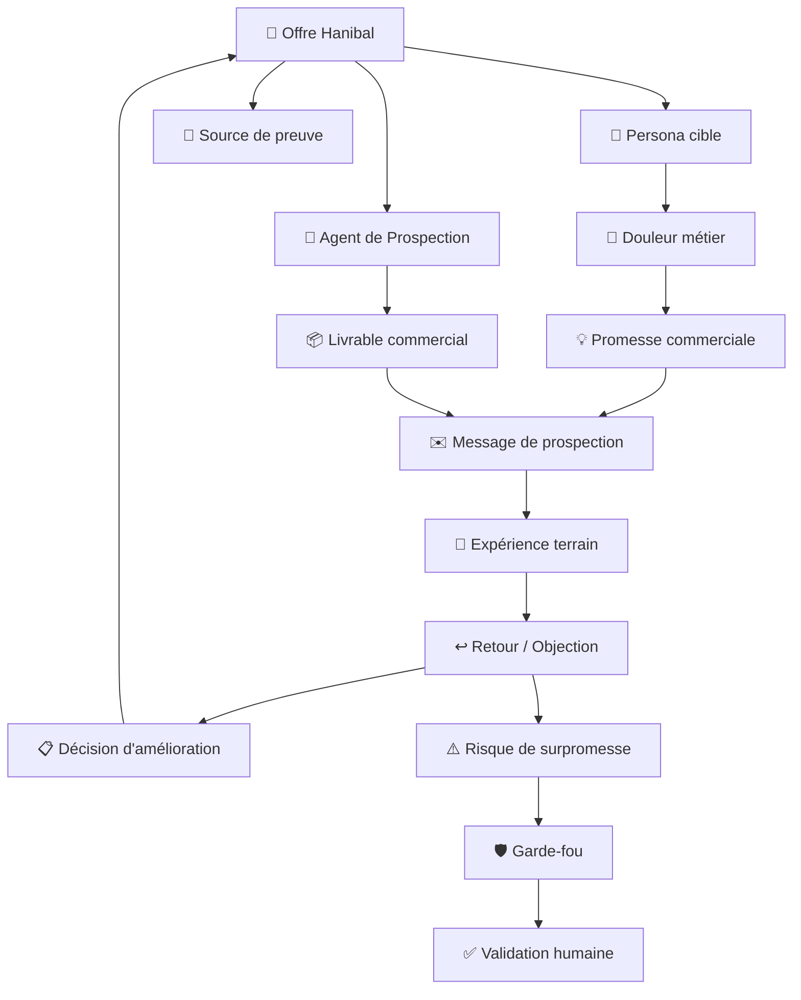

---

## 5. Structure des données (data mesh simplifié)

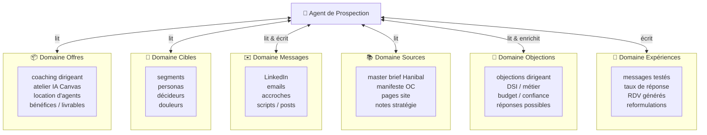

---

## 6. Le State — Colonne vertébrale du graph

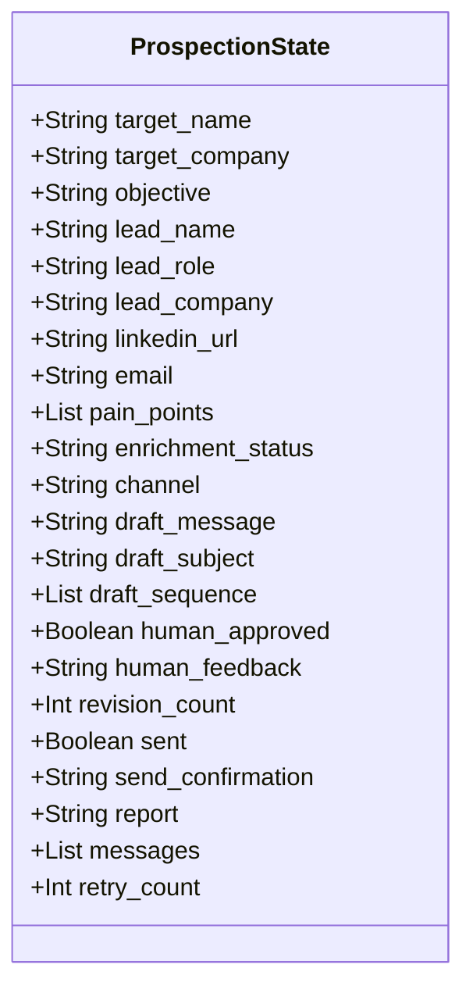

---

## 7. Vue d'ensemble du Graph LangGraph

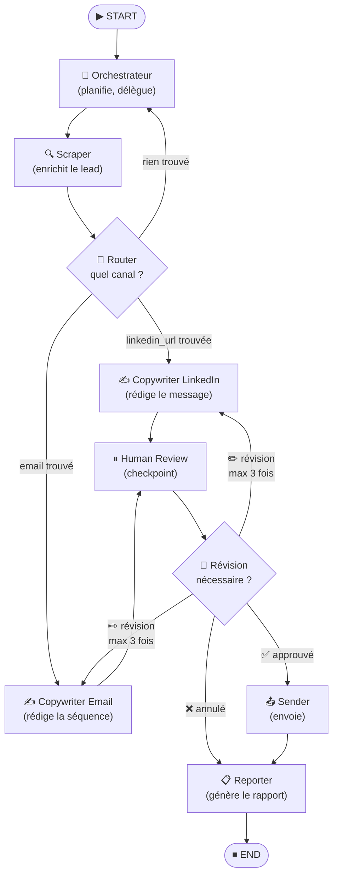

---

## 8. Nœuds et outils connectés

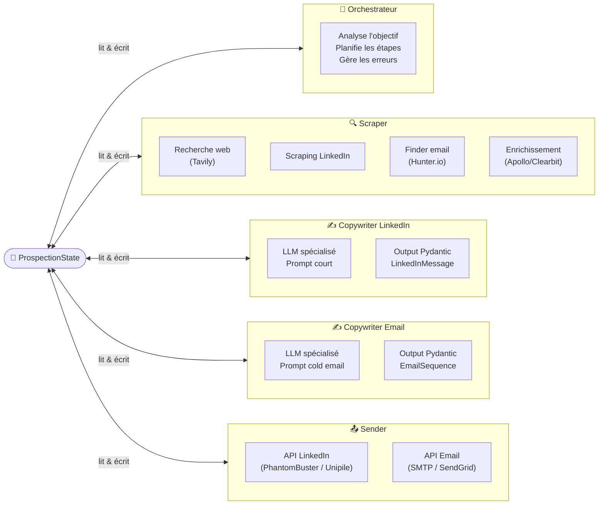

---

## 9. Workflow humain-agent (10 étapes)

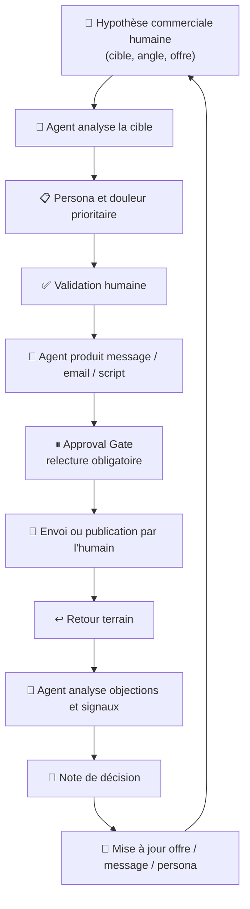

---

## 10. Séquence complète avec Human-in-the-loop

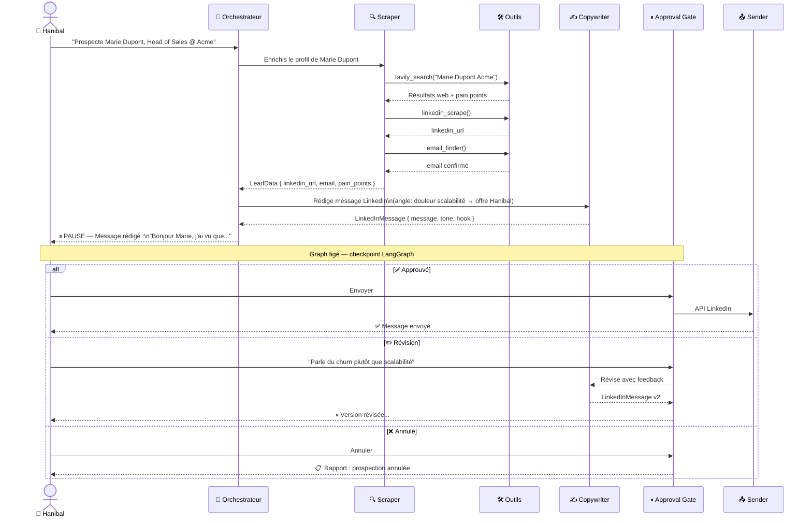

---

## 11. Conditions de routage

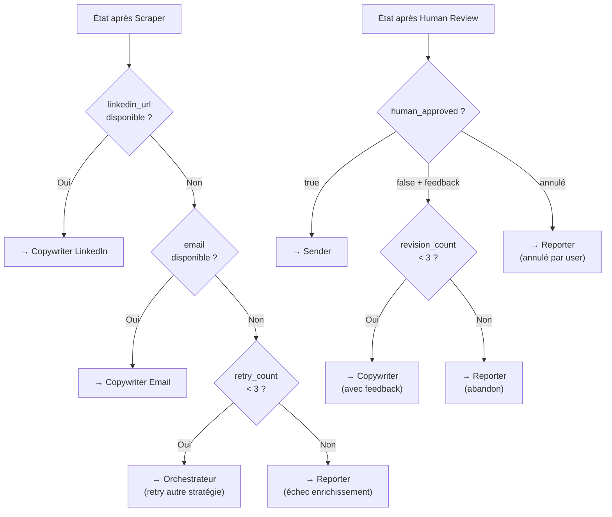

---

## 12. Objet Cognitif — Contrat de fonctionnement

```yaml
oc_id: oc-agent-prospection-hanibal-v0.1
name: Agent de Prospection Hanibal
status: prototype
version: 0.1.0

identity:
  role: Assistant métier spécialisé dans l'acquisition commerciale B2B
  purpose: Transformer les offres et expertises Hanibal en actions concrètes de prospection

scope:
  allowed: [stratégie commerciale, prospection B2B, LinkedIn, pages offre, scripts RDV]
  excluded: [envoi autonome, engagement contractuel, promesses financières, décisions juridiques]

guardrails:
  human_validation_required:
    - publication externe
    - envoi de message
    - engagement tarifaire
    - promesse de résultat
    - mention référence client
  forbidden:
    - inventer des références
    - envoyer sans validation
    - promettre un ROI non démontré
    - présenter l'agent comme autonome

metrics:
  business: [messages produits, messages validés, taux de réponse, RDV générés]
  quality:  [clarté, cohérence Hanibal, taux de reformulation, respect garde-fous]
  cost:     [coût par message, temps supervision, coût par RDV préparé]
```

---

## 13. Roadmap de bootstrap (6 phases)

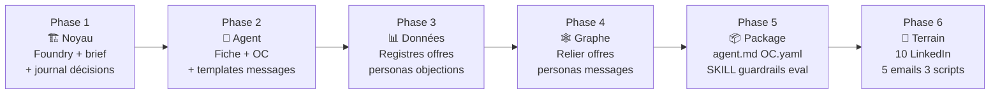

---

## 14. Structure de fichiers cible

```
agent-prospection-hanibal/
├── agent.md
├── OC.yaml
├── SKILL.md
├── examples.md
├── output_schema.json
├── guardrails.md
├── eval.md
├── prompts/
│   ├── persona.md
│   ├── message-linkedin.md
│   ├── email-prospection.md
│   ├── script-rdv.md
│   └── analyse-objections.md
├── data/
│   ├── offers.csv
│   ├── personas.csv
│   ├── objections.csv
│   ├── sources.csv
│   └── experiments.csv
└── changelog.md
```

---

## 15. Ce qu'il reste à implémenter

| Nœud | Statut | Notes |
|---|---|---|
| `orchestrator` | À faire | LLM + planification |
| `scraper` | À faire | Tavily déjà dispo dans le projet |
| `linkedin_writer` | À faire | Prompt Pydantic structured output |
| `email_writer` | À faire | Prompt Pydantic structured output |
| `human_review` | À faire | Interrupt LangGraph + lecture feedback |
| `sender` | À faire | API LinkedIn / SMTP |
| `reporter` | À faire | Résumé structuré |
| **State** | ✅ Défini | Voir section 6 |
| **Routing** | ✅ Défini | Voir section 11 |
| **OC.yaml** | ✅ Défini | Voir section 12 |
| **Registres data** | À créer | offers, personas, objections, sources |
