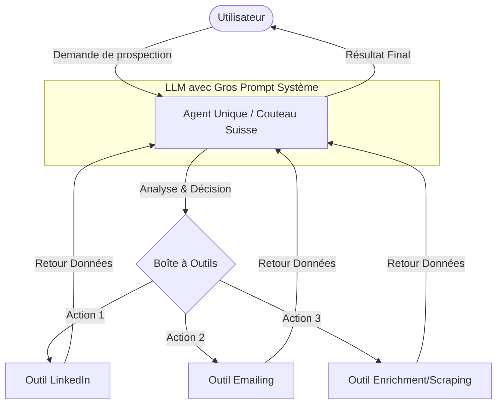
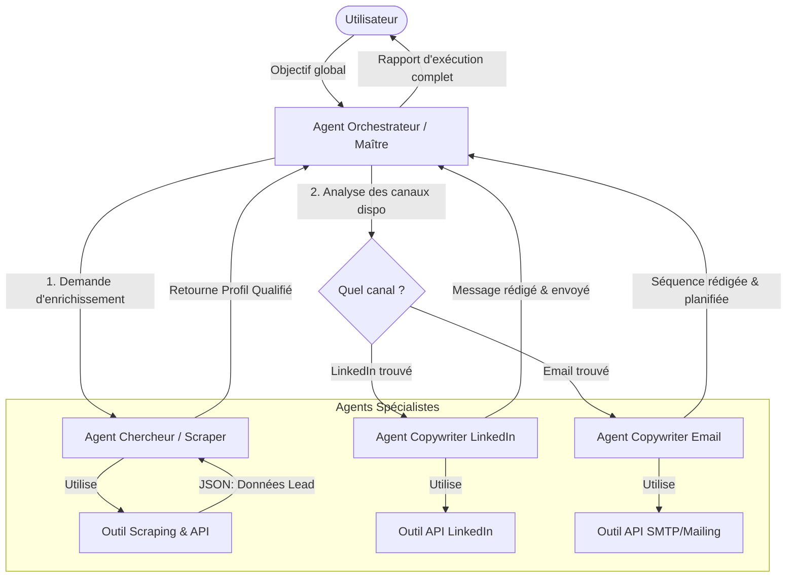
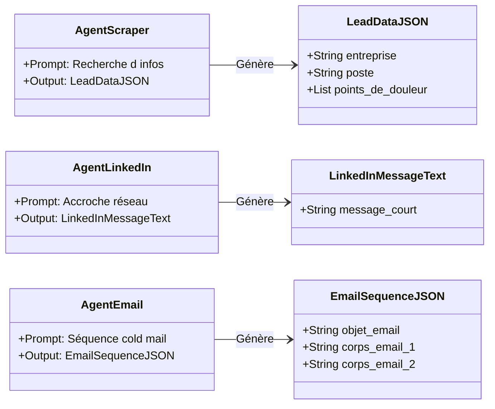
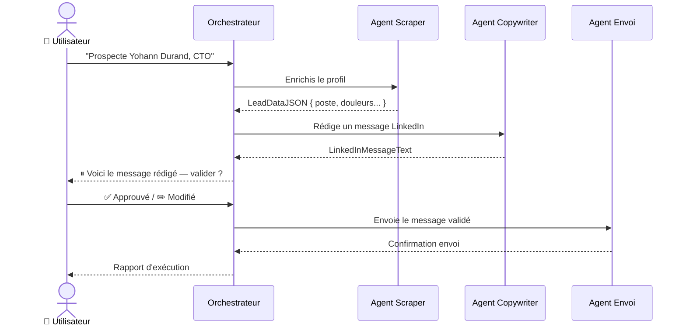

# Stratégie d'architecture agents

- Different response template per agent ?
- Multi-agent ?

---

# Comparaison d'Architecture d'Agents pour SaaS de Prospection

Ce document compare deux approches d'architecture pour la création d'un SaaS d'agents de prospection utilisant LangChain / LangGraph : l'approche **Monolithe (Agent Unique)** et l'approche **Orchestrateur & Spécialistes (Multi-Agents)**.

---

## 1. Tableau Comparatif Global

| Critère | Approche A : Agent Unique (Monolithe) | Approche B : Multi-Agents (Spécialisés) |
| :--- | :--- | :--- |
| **Complexité Initiale** | Très faible (rapide à prototyper) | Modérée à élevée (gestion des flux) |
| **Fiabilité & Précision** | Faible à moyenne (risque de dérive/hallucination) | Élevée (missions ultra-ciblées) |
| **Gestion des Prompts** | Un seul prompt massif (dilution de l'attention) | Plusieurs prompts courts et spécialisés |
| **Scalabilité (Ajout d'outils)** | Difficile (complexifie le prompt unique) | Très simple (ajout d'un nouvel agent) |
| **Consommation de Tokens** | Économique sur les tâches simples | Plus élevée (échanges entre agents) |
| **Maintenance & Débug** | Complexe (effet papillon sur le prompt unique) | Isolée (on corrige uniquement l'agent défaillant) |

---

## 2. Approche A : L'Agent Unique (Couteau Suisse)

Dans cette configuration, un seul agent reçoit la demande de l'utilisateur. Il possède un grand prompt système décrivant toute la logique métier et a un accès direct à l'ensemble des outils (LinkedIn, Email, Grattage de données, etc.).

### Avantages

- **Simplicité technique** : Un seul thread LangChain, une seule boucle de décision.
- **Rapidité de développement** : Idéal pour un MVP jetable.
- **Coût en tokens réduit** : Pas d'appels inter-agents superflus.

### Inconvénients

- **Lost in the Middle** : Le LLM oublie des instructions au milieu d'un prompt trop lourd.
- **Erreurs d'outils** : Risque accru que l'agent utilise un outil d'emailing pour envoyer un message LinkedIn ou vice-versa.
- **Rigidité** : Modifier une règle métier peut casser un comportement qui fonctionnait ailleurs.

### Schéma de Fonctionnement

---

## 3. Approche B : L'Architecture Multi-Agents (Recommandée)

Cette approche sépare les responsabilités. Un agent **Orchestrateur (Maître)** reçoit la demande globale, planifie les étapes, puis délègue le travail à des agents **Spécialistes**. Chaque spécialiste ne gère qu'un domaine précis et un format de réponse strict (Pydantic Output Schema).

### Avantages

- **Fiabilité maximale** : Les prompts des spécialistes sont courts, précis et directifs.
- **Modularité** : Si l'API LinkedIn change, on modifie uniquement l'agent LinkedIn sans toucher au reste.
- **Évolution fluide** : Facile d'ajouter un agent "Spécialiste Twitter/X" ou "Spécialiste CRM".
- **Gestion d'états complexes** : Parfaitement adapté à LangGraph pour des boucles de rétroaction.

### Inconvénients

- **Latence** : Plus de requêtes LLM en cascade augmentent le temps de réponse total.
- **Coût** : Plus de tokens consommés pour orchestrer et formater les données entre agents.

### Schéma de Fonctionnement (Multi-Agents avec LangGraph)

---

## 4. Les Formats de Réponse par Agent (Output Templates)

Pour que l'architecture Multi-Agents fonctionne, chaque agent doit avoir son propre **Template de Réponse formalisé**. En utilisant LangChain, cela se traduit par des objets structurés via `WithStructuredOutput` de Pydantic.

---

## 5. Recommandation Technique : LangGraph

Si on utilise l'écosystème LangChain, ne pas rester sur les structures classiques d'agents séquentiels. S'orienter directement vers **LangGraph**.

### Pourquoi LangGraph ?

- **Persistance de l'état (State)** : On définit un "State" global (ex: la fiche du lead en cours de traitement). Chaque agent vient lire et enrichir cet état à tour de rôle.
- **Gestion des graphes cycliques** : Si l'agent LinkedIn tente d'envoyer un message mais que le compte du lead est introuvable, le graphe peut renvoyer l'information à l'Orchestrateur pour qu'il bascule sur l'agent Email.
- **Contrôle humain (Human-in-the-loop)** : Crucial pour un SaaS de prospection. On peut figer le graphe après la génération du message pour permettre à l'utilisateur de valider ou modifier avant l'envoi réel.

### Flux LangGraph avec Human-in-the-loop

