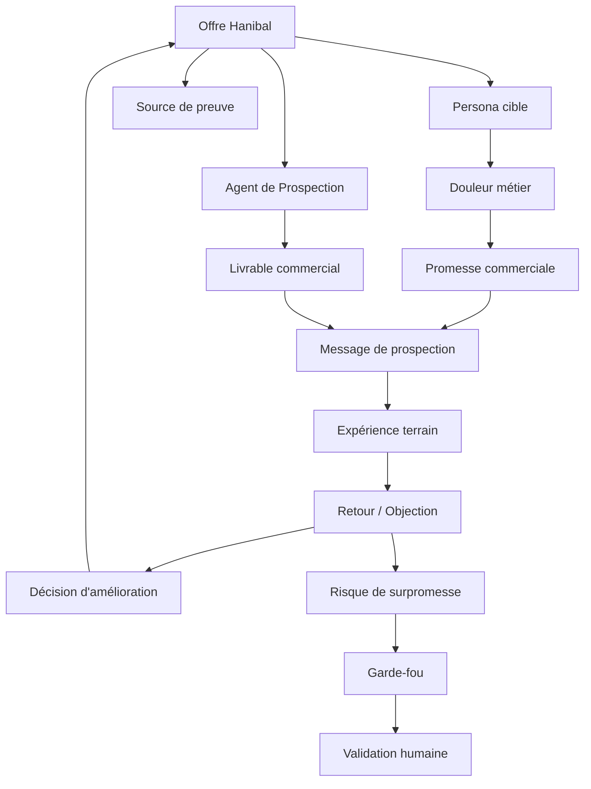
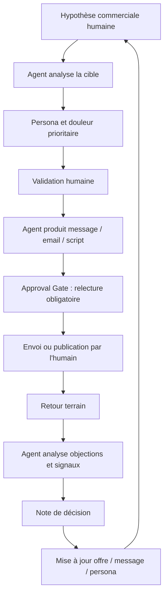

# Hanibal — Rapport d’expérimentation de l’Agent de Prospection / Agent Acquisition

**Version :** 0.1  
**Statut :** Document de cadrage expérimental  
**Objet :** Structurer l’expérimentation interne de l’Agent de Prospection Hanibal selon une démarche Golden Circles  
**Principe directeur :** Hanibal doit appliquer à lui-même la méthode qu’il souhaite vendre : concevoir, gouverner, tester et améliorer des agents IA supervisés dans le travail réel.

---

## 0. Résumé exécutif

L’expérimentation de l’Agent de Prospection, aussi appelé dans la conversation **Agent Acquisition Hanibal**, constitue le premier cas d’usage interne destiné à démontrer la méthode Hanibal selon le principe **“eat your own dog food”**.

L’objectif n’est pas simplement de créer un assistant qui rédige des messages commerciaux. L’objectif est de concevoir un **agent IA supervisé**, documenté, gouverné, mesurable et améliorable, capable d’aider Hanibal à structurer son acquisition commerciale tout en servant de démonstrateur de sa propre approche.

Cette expérimentation doit permettre de prouver que Hanibal ne vend pas une théorie sur la gouvernance des agents IA, mais une méthode applicable à un besoin métier réel : identifier des cibles, formuler des offres, rédiger des messages, préparer des rendez-vous, analyser des objections, suivre des opportunités et transformer les apprentissages terrain en amélioration continue.

Le cœur de l’expérimentation repose sur quatre idées :

- **Partir du travail réel** : comprendre comment Hanibal prospecte, argumente, échange, relance, reformule et apprend de ses contacts.
- **Structurer les données** : organiser les offres, cibles, personas, sources, messages, objections, décisions et retours dans un socle exploitable.
- **Formaliser l’agent** : décrire sa mission, ses limites, ses sources autorisées, ses livrables, ses garde-fous et ses points de validation humaine dans un **Objet Cognitif**.
- **Mesurer la valeur** : évaluer la qualité des productions, le temps gagné, la charge de supervision, les réponses obtenues, la clarté de l’offre et le coût par tâche.

L’Agent de Prospection devient ainsi le premier **actif agentique gouverné** de Hanibal.

---

# 1. Intention stratégique de l’expérimentation

## WHY — Pourquoi expérimenter un Agent de Prospection ?

Hanibal a besoin de transformer une vision riche en capacité commerciale concrète. La conversation a montré que le projet dispose d’une ambition forte : devenir une méthode d’architecture cognitive d’entreprise permettant de concevoir et gouverner des agents IA supervisés. Mais cette ambition doit être rendue visible par une preuve.

L’Agent de Prospection répond à cette nécessité.

Il doit aider Hanibal à clarifier son offre, produire des contenus commerciaux, identifier les bonnes cibles, préparer des messages, anticiper les objections et suivre les retours marché.

Le choix de la prospection est stratégique, car il relie directement l’expérimentation à la survie et au développement du projet. Si Hanibal veut vendre des agents IA supervisés, le premier agent doit aider Hanibal à se vendre lui-même.

L’expérimentation répond donc à une question centrale :

> Comment Hanibal peut-il utiliser sa propre méthode pour construire un agent IA qui développe son acquisition commerciale tout en démontrant la valeur de son approche ?

## HOW — Comment l’expérimentation doit-elle être menée ?

L’expérimentation doit être conduite comme un vrai projet Hanibal, et non comme une simple création de GPT.

Elle doit respecter les principes suivants :

- partir du besoin métier réel ;
- documenter le travail de prospection existant ;
- distinguer les tâches à supprimer, simplifier, assister, garder humainement ou sécuriser ;
- structurer les données nécessaires ;
- formaliser l’agent sous forme d’Objet Cognitif ;
- définir ses livrables attendus ;
- encadrer les validations humaines ;
- mesurer la qualité, la charge de supervision et la valeur ;
- itérer chaque semaine à partir des retours.

Le mode d’expérimentation doit rester simple, mais rigoureux.

Il ne s’agit pas de construire une plateforme complète. Il s’agit de construire un **MVP agentique** :

- un Project de travail ;
- un GPT Hector ;
- un Agent de Prospection ;
- un mini-socle de données ;
- un graphe simplifié ;
- un package agent ;
- une preuve d’usage.

## WHAT — Ce que l’expérimentation doit produire

L’expérimentation doit produire des livrables concrets :

- une fiche complète de l’Agent de Prospection ;
- une version commerciale de sa promesse ;
- un Objet Cognitif synthétique ;
- une structure de fichiers agent ;
- un registre des sources ;
- un registre des offres ;
- un registre des cibles ;
- un registre des objections ;
- des templates de messages ;
- des scripts de rendez-vous ;
- des pages ou sections d’offre ;
- un mini-graphe des relations entre offres, cibles, agents, sources et livrables ;
- une grille d’évaluation ;
- un journal de décisions ;
- un bilan d’usage.

La preuve attendue n’est pas seulement documentaire. Elle doit être opérationnelle : l’agent doit réellement produire des supports utiles à Hanibal.

---

# 2. Positionnement de l’Agent de Prospection dans Hanibal

## WHY — Pourquoi cet agent est-il central dans le projet ?

L’Agent de Prospection est central parce qu’il se situe à la jonction entre la vision stratégique et le besoin économique immédiat.

Hanibal porte une ambition intellectuelle forte : Objets Cognitifs, gouvernance des agents, graphes de connaissances, data mesh simplifié, workflows humain-agent. Mais cette ambition doit être traduite en offres compréhensibles et vendables.

L’Agent de Prospection doit aider à transformer :

- une doctrine en message commercial ;
- une méthode en offre ;
- une offre en argumentaire ;
- un argumentaire en message de prospection ;
- un message en rendez-vous potentiel ;
- un retour terrain en apprentissage.

Il joue donc un rôle double :

- **outil interne d’acquisition** ;
- **démonstrateur de la méthode Hanibal**.

## HOW — Comment doit-il être positionné ?

L’agent ne doit pas être présenté comme un vendeur autonome.

Il doit être positionné comme un **assistant métier supervisé**, capable de préparer le travail commercial mais pas de l’exécuter sans validation humaine.

Il peut :

- proposer des cibles ;
- formuler des angles ;
- rédiger des brouillons ;
- analyser les objections ;
- préparer des séquences ;
- produire des contenus ;
- structurer un suivi.

Il ne doit pas :

- envoyer des messages sans validation ;
- inventer des références clients ;
- promettre un retour sur investissement non démontré ;
- prendre des engagements commerciaux ;
- modifier une base CRM sans contrôle ;
- publier du contenu externe sans relecture.

Cette distinction est fondamentale. Elle permet d’éviter la surpromesse et d’inscrire l’agent dans une logique de supervision.

## WHAT — Ce qu’il doit devenir

L’Agent de Prospection doit devenir un **agent prototype stabilisé**.

Il doit être suffisamment formalisé pour être :

- utilisé en interne ;
- évalué ;
- amélioré ;
- présenté comme preuve ;
- adapté plus tard à un client ;
- transformé en offre de location d’agent ;
- intégré dans un catalogue d’agents Hanibal.

Il est donc à la fois un outil, un cas d’usage, un actif de connaissance et un support commercial.

---

# 3. Périmètre fonctionnel de l’Agent de Prospection

## WHY — Pourquoi définir un périmètre précis ?

Un agent IA mal cadré devient vite un assistant généraliste. Il peut produire beaucoup, mais sans cohérence, sans limites et sans valeur mesurable.

Pour Hanibal, le périmètre est stratégique : il permet de démontrer qu’un agent supervisé n’est pas une boîte noire. Il est un composant métier avec un rôle défini.

Le périmètre répond à une question :

> Que doit faire l’Agent de Prospection pour créer de la valeur, sans dépasser son rôle ?

## HOW — Comment cadrer le périmètre ?

Le périmètre doit être organisé autour de capacités précises.

L’Agent de Prospection peut intervenir sur sept fonctions principales :

1. **Clarification des segments cibles**
   - Identifier les types d’organisations pertinentes.
   - Distinguer PME, ETI, associations, organismes publics, cabinets, directions métiers.
   - Repérer les décideurs potentiels.

2. **Formalisation des personas d’achat**
   - Décrire les douleurs, objectifs, objections et motivations des dirigeants ou managers.
   - Distinguer les besoins du dirigeant, du responsable métier, du DSI, du responsable innovation ou du manager opérationnel.

3. **Structuration des offres Hanibal**
   - Clarifier le coaching dirigeant.
   - Clarifier l’atelier IA Canvas.
   - Clarifier la location d’agents IA supervisés.
   - Traduire les Objets Cognitifs en bénéfices compréhensibles.

4. **Production de messages commerciaux**
   - Rédiger des messages LinkedIn.
   - Préparer des emails de prospection.
   - Créer des accroches.
   - Adapter le ton selon la cible.

5. **Préparation des rendez-vous**
   - Produire des scripts d’appel.
   - Préparer des questions de diagnostic.
   - Anticiper les objections.
   - Structurer un déroulé de rendez-vous.

6. **Analyse des retours terrain**
   - Identifier les objections récurrentes.
   - Déduire les formulations à améliorer.
   - Classer les signaux d’intérêt.
   - Proposer des ajustements de l’offre.

7. **Capitalisation commerciale**
   - Tenir un journal des hypothèses.
   - Alimenter un registre d’objections.
   - Proposer des tests de messages.
   - Produire une synthèse hebdomadaire.

## WHAT — Livrables attendus

L’agent doit produire :

- une matrice de ciblage ;
- des personas ;
- une proposition de valeur ;
- des messages LinkedIn ;
- des emails de prospection ;
- des scripts de rendez-vous ;
- une grille d’objections ;
- des pages ou sections d’offre ;
- un calendrier éditorial ;
- une synthèse des actions commerciales ;
- une note de décision ;
- un bilan hebdomadaire d’apprentissage.

---

# 4. Travail réel de prospection et grille de tri

## WHY — Pourquoi partir du travail réel ?

La prospection n’est pas une simple chaîne mécanique. Elle implique du jugement, de l’adaptation, de la lecture de signaux faibles, de la formulation, de la relance, de la relation et de la confiance.

Si l’Agent de Prospection est construit uniquement sur un processus théorique, il risque de produire des messages génériques, peu incarnés et peu efficaces.

Il faut donc partir du travail réel :

- comment Hanibal parle aujourd’hui de son projet ;
- quelles formulations fonctionnent ;
- quelles formulations sont trop complexes ;
- quelles objections apparaissent ;
- quels publics comprennent rapidement ;
- quels publics décrochent ;
- quels messages donnent envie de poursuivre ;
- quelles preuves manquent.

## HOW — Comment analyser ce travail ?

La conversation propose une grille de tri stratégique :

- **Supprimer** : enlever les tâches ou messages qui n’apportent pas de valeur.
- **Simplifier** : clarifier les formulations trop complexes.
- **Assister** : confier à l’agent la préparation de brouillons ou d’analyses.
- **Garder humainement** : conserver à l’humain les arbitrages relationnels et commerciaux.
- **Sécuriser** : encadrer les messages externes, les promesses et les engagements.

Appliquée à la prospection, cette grille donne :

### Supprimer

- les messages trop longs ;
- les formulations trop techniques pour un premier contact ;
- les argumentaires qui mélangent trop vite manifeste, architecture et offre ;
- les promesses non vérifiables.

### Simplifier

- la promesse Hanibal ;
- la distinction entre coaching, IA Canvas et location d’agents ;
- l’explication des Objets Cognitifs ;
- le discours dirigeant.

### Assister

- la rédaction de messages ;
- la préparation de rendez-vous ;
- l’analyse des objections ;
- la reformulation des offres ;
- la production de contenus LinkedIn.

### Garder humainement

- l’arbitrage final du message ;
- la relation commerciale ;
- la négociation ;
- l’engagement tarifaire ;
- la décision de relancer ou non.

### Sécuriser

- toute promesse de résultat ;
- toute référence client ;
- toute formulation réglementaire ;
- toute affirmation sur la conformité ;
- tout message public.

## WHAT — Ce que cette analyse doit produire

L’analyse du travail réel doit produire :

- une cartographie simple du processus de prospection ;
- une liste des tâches assistables ;
- une liste des tâches humaines non délégables ;
- une liste des points de validation ;
- une liste des risques de surpromesse ;
- une liste des irritants commerciaux ;
- une base de cas réels pour entraîner l’agent.

---

# 5. Données nécessaires à l’Agent de Prospection

## WHY — Pourquoi structurer les données avant d’utiliser l’agent ?

Un agent de prospection peut produire des messages très convaincants à partir d’informations insuffisantes ou instables. C’est un risque.

Pour éviter cela, Hanibal doit fournir à l’agent des données de référence claires.

L’objectif est de permettre à l’agent de répondre à trois questions :

- Que vend Hanibal ?
- À qui Hanibal s’adresse ?
- Avec quelles preuves et quelles limites ?

Sans cette base, l’agent risque de créer des messages incohérents, trop vagues ou trop ambitieux.

## HOW — Comment structurer les données ?

La conversation propose un **MDM minimal** et un **data mesh simplifié**.

Pour l’Agent de Prospection, les domaines prioritaires sont :

### Domaine Offres

Contient :

- coaching dirigeant ;
- atelier IA Canvas ;
- location d’agents IA ;
- bénéfices ;
- livrables ;
- objections ;
- niveaux d’offre.

### Domaine Cibles

Contient :

- segments ;
- personas ;
- décideurs ;
- douleurs ;
- priorités ;
- objections probables.

### Domaine Messages

Contient :

- messages LinkedIn ;
- emails ;
- accroches ;
- scripts ;
- posts ;
- pages d’offre.

### Domaine Sources

Contient :

- master brief Hanibal ;
- manifeste OC ;
- pages du site ;
- notes de stratégie ;
- décisions ;
- retours terrain.

### Domaine Objections

Contient :

- objections dirigeant ;
- objections DSI ;
- objections métier ;
- objections budget ;
- objections confiance ;
- réponses possibles.

### Domaine Expériences

Contient :

- messages testés ;
- retours obtenus ;
- taux de réponse ;
- rendez-vous générés ;
- reformulations ;
- décisions d’amélioration.

## WHAT — Registres minimaux à créer

L’expérimentation doit créer au minimum :

- `offers.csv` ou `offers.md` ;
- `targets.csv` ou `targets.md` ;
- `personas.md` ;
- `messages.md` ;
- `objections.md` ;
- `sources.md` ;
- `decision-log.md` ;
- `experiments-log.md`.

Chaque registre doit être simple, maintenable et utilisable par l’agent.

---

# 6. Graphe de connaissances simplifié pour l’Agent de Prospection

## WHY — Pourquoi créer un graphe ?

La prospection repose sur des relations.

Une offre s’adresse à une cible.  
Une cible a une douleur.  
Une douleur appelle une promesse.  
Une promesse doit être soutenue par une preuve.  
Une objection doit recevoir une réponse.  
Un message doit être adapté à un persona.  
Un retour terrain doit modifier une hypothèse.

Un dossier documentaire ne suffit pas à représenter ces relations. Le graphe permet de les rendre explicites.

## HOW — Comment construire un graphe simple ?

Le graphe n’a pas besoin d’être complexe au démarrage.

Il peut être composé de quelques types de nœuds :

- Offre ;
- Agent ;
- Persona ;
- Segment ;
- Douleur ;
- Promesse ;
- Message ;
- Objection ;
- Source ;
- Livrable ;
- Décision ;
- Expérience ;
- Risque.

Et de quelques relations :

- une offre cible un persona ;
- un persona exprime une douleur ;
- une douleur est traitée par une promesse ;
- une promesse est soutenue par une source ;
- un message est adapté à un persona ;
- une objection concerne une offre ;
- une réponse traite une objection ;
- une expérience teste un message ;
- une décision modifie une offre ;
- un agent produit un livrable ;
- un risque impose un garde-fou.

## WHAT — Schéma Mermaid de départ



Ce graphe est volontairement simple. Il sert d’abord à raisonner et à structurer l’apprentissage.

---

# 7. Objet Cognitif de l’Agent de Prospection

## WHY — Pourquoi formaliser un Objet Cognitif ?

L’Objet Cognitif évite que l’Agent de Prospection reste un simple assistant conversationnel.

Il décrit le contrat de fonctionnement de l’agent.

Il répond aux questions suivantes :

- Quel est son rôle ?
- Quelle est sa mission ?
- Quelles sources peut-il utiliser ?
- Que peut-il produire ?
- Que ne peut-il pas faire ?
- Quand doit-il demander validation ?
- Comment mesure-t-on sa qualité ?
- Comment évolue-t-il ?

L’Objet Cognitif rend l’agent gouvernable.

## HOW — Comment structurer l’Objet Cognitif ?

L’Objet Cognitif de l’Agent de Prospection doit comporter :

- identité ;
- mission ;
- utilisateurs ;
- périmètre ;
- sources autorisées ;
- entrées attendues ;
- sorties attendues ;
- actions autorisées ;
- actions interdites ;
- garde-fous ;
- approval gates ;
- critères qualité ;
- métriques ;
- coût par tâche ;
- cycle de vie.

## WHAT — Version synthétique en YAML

```yaml
oc_id: oc-agent-prospection-hanibal-v0.1
name: Agent de Prospection Hanibal
status: prototype
owner: Hanibal
version: 0.1.0

identity:
  role: Assistant métier spécialisé dans l'acquisition commerciale B2B
  purpose: Transformer les offres, idées et expertises Hanibal en actions concrètes de prospection
  primary_users:
    - Fondateur Hanibal
    - Consultant commercial
    - Responsable acquisition

scope:
  allowed_domains:
    - stratégie commerciale
    - prospection B2B
    - contenus LinkedIn
    - pages d'offre
    - argumentaires
    - scripts de rendez-vous
    - analyse des objections
  excluded_domains:
    - envoi automatique sans validation humaine
    - engagement contractuel
    - promesses financières non vérifiées
    - décisions juridiques sensibles
    - traitement commercial agressif ou trompeur

inputs:
  expected:
    - description d'offre
    - cible client
    - douleur métier
    - contexte de marché
    - contraintes commerciales
    - retours terrain
  optional:
    - exemples de contenus
    - notes de rendez-vous
    - objections clients
    - pages du site
    - messages précédents

sources:
  authorized:
    - master brief Hanibal
    - description des offres
    - manifeste Objets Cognitifs
    - registre des cibles
    - registre des objections
    - journal de décisions
    - retours terrain validés
  forbidden:
    - références clients non vérifiées
    - promesses de ROI non démontrées
    - données personnelles non nécessaires
    - informations confidentielles non autorisées

reasoning_rules:
  principles:
    - distinguer symptôme, douleur et opportunité
    - adapter le message au persona cible
    - expliciter les hypothèses commerciales
    - éviter les promesses excessives
    - produire des livrables relisibles par un humain
    - privilégier la clarté commerciale sur la sophistication technique

guardrails:
  human_validation_required:
    - publication externe
    - envoi de message de prospection
    - engagement tarifaire
    - promesse de résultat
    - mention d'une référence client
  forbidden_behaviors:
    - inventer des références
    - simuler une preuve inexistante
    - envoyer directement une communication
    - présenter l'agent comme autonome
    - manipuler une cible commerciale de manière trompeuse

outputs:
  formats:
    - fiche persona
    - proposition de valeur
    - message LinkedIn
    - email de prospection
    - script de rendez-vous
    - grille d'objections
    - page d'offre
    - calendrier éditorial
    - note de décision
  quality_criteria:
    - clarté
    - précision
    - cohérence avec Hanibal
    - adaptation à la cible
    - prudence sur les promesses
    - actionnabilité

supervision:
  expected_review_time: "5 à 15 minutes par livrable"
  review_frequency: "à chaque production externe"
  approval_mode: "validation humaine obligatoire avant diffusion"
  cognitive_burden: "medium"

metrics:
  business:
    - nombre de messages produits
    - nombre de messages validés
    - taux de réponse
    - rendez-vous générés
    - objections collectées
  quality:
    - clarté perçue
    - cohérence de l'offre
    - taux de reformulation nécessaire
    - respect des garde-fous
  cost:
    - coût par message
    - temps de supervision
    - coût par rendez-vous préparé

lifecycle:
  review_cycle: weekly
  changelog_required: true
  next_version_goals:
    - intégrer un registre de prospects
    - ajouter une grille de scoring des messages
    - connecter un suivi CRM supervisé
    - produire un rapport hebdomadaire automatisé
```

---

# 8. Workflow humain-agent de prospection

## WHY — Pourquoi définir un workflow humain-agent ?

L’Agent de Prospection ne doit pas remplacer la relation commerciale humaine.

Il doit préparer, structurer, proposer et analyser. L’humain doit arbitrer, valider, personnaliser et engager la relation.

Sans workflow clair, deux dérives apparaissent :

- l’agent produit trop, l’humain relit tout et se fatigue ;
- l’agent est trop libre, et l’organisation perd le contrôle du discours commercial.

Le workflow humain-agent permet de répartir correctement les rôles.

## HOW — Comment organiser ce workflow ?

Le workflow doit suivre une séquence simple :

1. L’humain définit une cible ou une hypothèse.
2. L’agent propose une analyse de persona.
3. L’humain valide ou ajuste.
4. L’agent produit un message ou une séquence.
5. L’humain relit et valide.
6. L’humain envoie ou publie.
7. L’agent analyse les retours.
8. L’humain prend les décisions commerciales.
9. L’agent met à jour les hypothèses.
10. Le cycle recommence.

## WHAT — Schéma Mermaid du workflow



Ce workflow positionne l’humain comme arbitre, pas comme simple correcteur permanent.

---

# 9. Utilisation de Claude Projects, GPTs, Claude Code et Codex

## WHY — Pourquoi mobiliser plusieurs environnements ?

L’expérimentation ne doit pas dépendre d’un seul outil.

Chaque environnement joue un rôle différent :

- Claude Projects pour la matière longue et la consolidation documentaire ;
- GPTs pour le prototype stabilisé de l’agent ;
- Claude Code pour la structuration des fichiers, skills et scripts ;
- Codex pour l’industrialisation logicielle éventuelle.

Cette séparation évite de confondre réflexion, agent stabilisé, développement et automatisation.

## HOW — Comment répartir les rôles ?

### Claude Projects

À utiliser comme espace documentaire profond pour :

- notes stratégiques ;
- manifeste OC ;
- corpus d’offres ;
- retours terrain ;
- analyses longues ;
- versions successives ;
- décisions.

### GPT Hector

À utiliser comme agent méthodologique stabilisé pour :

- transformer un besoin en fiche agent ;
- produire un Objet Cognitif ;
- rédiger des messages ;
- analyser les objections ;
- proposer une roadmap ;
- générer des livrables standardisés.

### Claude Code

À utiliser pour :

- créer la structure de fichiers ;
- maintenir les `SKILL.md` ;
- écrire des scripts de validation ;
- organiser le package agent ;
- automatiser certaines conversions ;
- préparer les tests.

### Codex

À utiliser pour :

- coder les validateurs ;
- créer des scripts Python ;
- générer les fichiers JSON/CSV ;
- transformer les registres en graphe ;
- préparer des exports ;
- industrialiser les composants réutilisables.

## WHAT — Structure cible du package agent

```text
agent-prospection-hanibal/
├── agent.md
├── OC.yaml
├── SKILL.md
├── examples.md
├── output_schema.json
├── guardrails.md
├── eval.md
├── prompts/
│   ├── persona.md
│   ├── message-linkedin.md
│   ├── email-prospection.md
│   ├── script-rdv.md
│   └── analyse-objections.md
├── data/
│   ├── offers.csv
│   ├── personas.csv
│   ├── objections.csv
│   ├── sources.csv
│   └── experiments.csv
└── changelog.md
```

---

# 10. Évaluation de l’expérimentation

## WHY — Pourquoi évaluer ?

Un agent de prospection peut sembler utile parce qu’il produit vite. Mais la vitesse ne suffit pas.

Il faut mesurer :

- la qualité ;
- la pertinence ;
- la clarté ;
- la cohérence ;
- le respect des garde-fous ;
- la charge de supervision ;
- la valeur commerciale ;
- le coût par tâche.

L’évaluation permet de distinguer un gadget d’un véritable actif métier.

## HOW — Comment évaluer ?

L’évaluation doit combiner quatre dimensions.

### Valeur métier

- Le message est-il plus clair ?
- L’offre est-elle mieux formulée ?
- Le persona est-il plus précis ?
- Le rendez-vous est-il mieux préparé ?
- Le contenu produit-il un retour ?

### Qualité éditoriale

- Le texte est-il compréhensible ?
- Le ton est-il adapté ?
- Les promesses sont-elles maîtrisées ?
- Le message est-il différenciant ?
- Le jargon est-il évité ?

### Gouvernance

- Les sources sont-elles respectées ?
- Les limites sont-elles respectées ?
- Les validations humaines sont-elles déclenchées ?
- Les références sont-elles vérifiées ?
- Les risques sont-ils signalés ?

### Économie

- Combien de temps l’agent fait-il gagner ?
- Combien de temps de supervision ajoute-t-il ?
- Quel est le coût par livrable ?
- Quel est le coût par message validé ?
- Quel est le coût par opportunité générée ?

## WHAT — Grille d’évaluation simple

```markdown
# Grille d'évaluation — Agent de Prospection Hanibal

## 1. Valeur commerciale
- Le livrable aide-t-il à mieux vendre Hanibal ?
- Le message est-il adapté à une cible précise ?
- L'offre est-elle plus claire après usage de l'agent ?
- Le livrable peut-il être utilisé après relecture humaine ?

Score : /5

## 2. Clarté
- Le texte est-il lisible ?
- Le jargon est-il limité ?
- La proposition de valeur est-elle compréhensible ?
- Le message distingue-t-il bien problème, solution et bénéfice ?

Score : /5

## 3. Cohérence Hanibal
- Le livrable respecte-t-il la doctrine Hanibal ?
- L'agent évite-t-il la surpromesse ?
- Les Objets Cognitifs sont-ils bien compris ?
- Le discours reste-t-il adapté au niveau du destinataire ?

Score : /5

## 4. Gouvernance
- Les sources sont-elles fiables ?
- Les limites sont-elles explicites ?
- Les points de validation sont-ils respectés ?
- Les affirmations sensibles sont-elles signalées ?

Score : /5

## 5. Supervision
- Temps de relecture estimé :
- Nombre de corrections nécessaires :
- Charge cognitive ressentie :
- Validation possible sans réécriture lourde ?

Score : /5

## 6. Décision
- Utilisable tel quel
- Utilisable après retouche légère
- À retravailler fortement
- À rejeter
```

---

# 11. Roadmap de bootstrap de l’expérimentation

## WHY — Pourquoi une roadmap courte ?

Le risque de Hanibal est de construire une architecture trop riche avant d’avoir prouvé un usage.

La roadmap doit donc viser un résultat rapide :

> un agent interne utilisable, documenté, évalué et transformable en preuve commerciale.

## HOW — Comment organiser le bootstrap ?

Le bootstrap peut se faire en six phases.

### Phase 1 — Installer le noyau

Créer :

- Hanibal Foundry ;
- GPT Hector ;
- master brief ;
- doctrine courte des Objets Cognitifs ;
- dossier agent ;
- journal de décisions.

### Phase 2 — Créer l’Agent de Prospection

Produire :

- fiche agent ;
- version commerciale ;
- Objet Cognitif ;
- règles d’usage ;
- actions interdites ;
- templates de messages.

### Phase 3 — Structurer les données

Créer :

- registre des offres ;
- registre des personas ;
- registre des objections ;
- registre des sources ;
- registre des expériences.

### Phase 4 — Construire le graphe simple

Relier :

- offres ;
- personas ;
- douleurs ;
- promesses ;
- messages ;
- objections ;
- sources ;
- décisions ;
- risques.

### Phase 5 — Packager l’agent

Créer :

- `agent.md` ;
- `OC.yaml` ;
- `SKILL.md` ;
- `examples.md` ;
- `output_schema.json` ;
- `guardrails.md` ;
- `eval.md` ;
- `changelog.md`.

### Phase 6 — Tester en conditions réelles

Produire :

- 10 messages LinkedIn ;
- 5 emails de prospection ;
- 3 scripts de rendez-vous ;
- 2 pages ou sections d’offre ;
- 1 registre d’objections ;
- 1 bilan d’usage ;
- 1 cas d’usage publiable.

## WHAT — Résultat attendu à la fin du bootstrap

À la fin du bootstrap, Hanibal doit pouvoir montrer :

- l’agent utilisé ;
- son Objet Cognitif ;
- ses sources ;
- ses livrables ;
- ses garde-fous ;
- ses limites ;
- ses résultats ;
- ses corrections ;
- sa valeur ;
- sa charge de supervision ;
- son potentiel de transformation en offre client.

---

# 12. Preuve commerciale attendue

## WHY — Pourquoi transformer l’expérimentation en preuve ?

Hanibal doit démontrer sa crédibilité.

Le discours “nous concevons des agents supervisés” devient beaucoup plus fort si Hanibal peut dire :

> Nous avons commencé par appliquer cette méthode à notre propre acquisition commerciale.

La preuve interne est plus crédible qu’une promesse abstraite.

## HOW — Comment construire cette preuve ?

Il faut documenter l’expérience comme un mini cas client.

Le cas doit expliquer :

- le problème initial ;
- le choix de l’agent ;
- la méthode de cadrage ;
- la structuration des données ;
- la création de l’Objet Cognitif ;
- les livrables produits ;
- les validations humaines ;
- les résultats ;
- les limites ;
- les apprentissages.

## WHAT — Structure du cas d’usage publiable

```markdown
# Cas d'usage — Comment Hanibal utilise son propre Agent de Prospection

## Problème
Hanibal devait clarifier son offre et structurer ses actions d'acquisition.

## Solution
Création d'un Agent de Prospection supervisé, cadré par un Objet Cognitif.

## Méthode
Analyse du travail réel, structuration des offres, création de personas, registre des objections, génération de messages, validation humaine.

## Livrables
Messages LinkedIn, emails, scripts de rendez-vous, pages d'offre, grille d'objections, journal de décisions.

## Gouvernance
Sources autorisées, actions interdites, approval gates, validation humaine avant diffusion.

## Résultats
À compléter après test terrain.

## Limites
L'agent ne vend pas seul, ne contacte personne sans validation et ne formule pas de promesses non démontrées.

## Enseignement
Un agent IA devient utile lorsqu'il est cadré, documenté, supervisé et relié à des données fiables.
```

---

# 13. Synthèse finale

## WHY

Hanibal a besoin d’un premier agent interne pour prouver sa méthode.

L’Agent de Prospection est le meilleur candidat, car il répond à un besoin immédiat : développer l’acquisition commerciale tout en démontrant la valeur des agents IA supervisés.

## HOW

L’expérimentation doit être conduite avec la méthode Hanibal :

- travail réel ;
- grille de tri ;
- données fiables ;
- data mesh simplifié ;
- graphe de connaissances ;
- Objet Cognitif ;
- workflow humain-agent ;
- approval gates ;
- évaluation ;
- coût par tâche ;
- amélioration continue.

## WHAT

Le résultat attendu est un actif agentique complet :

- un agent utilisable ;
- un Objet Cognitif ;
- un package de fichiers ;
- des livrables commerciaux ;
- une grille d’évaluation ;
- un mini-graphe ;
- un journal de décisions ;
- une preuve commerciale.

La phrase à retenir :

> L’Agent de Prospection Hanibal n’est pas seulement un outil commercial. C’est le premier démonstrateur de la méthode Hanibal : concevoir des agents IA supervisés, gouvernés et utiles dans le travail réel.
